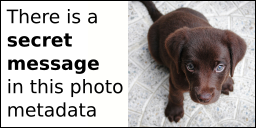

# Python scripts for hiding secrets in photos
The goal of this github repo is to offer Python :snake: simple scripts with simple algorithms for hiding secrets in photos.
These scripts can be used to **prepare or decode small puzzles like riddles or to learn programming** :smile:.


> [!important]
> The scripts proposed here only use "simplistic" methods to hide information in photos.
> There are much more advanced algorithms that exist, but that is not the purpose of this repo.
> Sorry if you are disappointed when you arrive here, you can always write to me if you have any questions or comments.
> Have fun :smile:


| Methods | Examples |
| :---: | :---: |
| [Hiding secrets with XOR operator](#hiding-secrets-with-xor-operator) | **Photo A** <br>  <br> **Photo B** <br>  <br>**Photo B** contains **Photo A**, hidden with a xor operation. **Photo B** can be used for as riddle for instance. |
| [Hiding secrets in photo metadata](#hiding-secrets-in-photo-metadata) |  <br>The metadata secret message is: <br>"**Hi, this is my secret msg, have fun :-)**" |


> [!note]
> Python scripts here are simple and short, without too many dependencies and without "main", arg parsing...
> The goal is to simplify copy/paste of these scripts into online Python compiler or to your own scripts...


---

**Table of contents**

<!-- @import "[TOC]" {cmd="toc" depthFrom=2 depthTo=6 orderedList=false} -->

<!-- code_chunk_output -->

- [Installation](#installation)
- [Hiding secrets with XOR operator](#hiding-secrets-with-xor-operator)
  - [Tips](#tips)
- [Hiding secrets in photo metadata](#hiding-secrets-in-photo-metadata)
- [Extra tips](#extra-tips)
  - [Ambigrams](#ambigrams)
  - [Adding a photo on top of your photo with secret](#adding-a-photo-on-top-of-your-photo-with-secret)
- [Used resources & Credits](#used-resources--credits)
- [TODO list](#todo-list)
- [Any questions or comments are welcome :bird:](#any-questions-or-comments-are-welcome-bird)

<!-- /code_chunk_output -->


## Installation
1. Clone this repo
2. Create a new Python **virtual environnement** and install dependencies with your favorite tools (Note: this step is not mandatory but recommended).
<details>
<summary>Simple virtual env example based on pip</summary>

```bash
# Create the virtual env and activate it
python3.11 -m venv venv
source venv/bin/activate
pip install --upgrade pip

# Install requirements
pip install -r requirements.txt
# or use simple commands like "pip install opencv-python"

# Leave the virtual env when necessary with the command "deactivate"
```
</details>

3. Use instructions from next chapters...


## Hiding secrets with XOR operator
The [Exclusive OR](https://en.wikipedia.org/wiki/XOR_gate) operator shortly named **XOR** operator is used here.
**Encoding** involves performing an XOR operation between the photo containing the secret and another photo of the same size containing a random noise (for example). This random noise has been previously duplicated, flipped (180° rotation), and will be added to the bottom of the result of the xor operation.
**Decoding** consists in doing a XOR operation between the riddle photo and its flipped version (180° rotation).


To **encode** the secret message photo into an "encrypted" photo:
```bash
# Get the usage
python xor180/encode.py
# Encode a secret with xor 180
python xor180/encode.py res/xor180_secret_msg.png res/xor180_encoded_secret_msg.png
```

To **decode** the "encrypted" photo to get the secret message photo:
```bash
# Get the usage
python xor180/decode.py
# Encode a secret with xor 180
python xor180/decode.py res/xor180_encoded_secret_msg.png res/xor180_decoded_secret_msg.png
```

> [!note]
> These scripts have been tested successfully on the image https://i.sstatic.net/B7g38.png from the StackExchange puzzling enigma named [This is important. I need you to listen…](https://puzzling.stackexchange.com/questions/28494/this-is-important-i-need-you-to-listen):
> ```$ wget https://i.sstatic.net/B7g38.png -O /tmp/B7g38.png```
> ```$ python xor180/decode.py /tmp/B7g38.png /tmp/B7g38_decoded.png```

### Tips
* The [Space Sheriff Gavan](https://en.wikipedia.org/wiki/Space_Sheriff_Gavan) is named [X-Or](https://fr.wikipedia.org/wiki/X-Or) in French (as the binary operator) so I add a 180°-rotated photo of this character as **a "clue" within the enigma** ;-)


* This puzzle uses a 180° rotation of half of the image because it makes the explanation relatively simple. However, one could use other shapes than horizontal, such as a simple square in the middle of the image, but in this case, a clue would have to be provided to help the player...


## Hiding secrets in photo metadata
:construction:

https://exiftool.org/ 
Install: simple unzip on Linux

Few examples:
```bash
# Update the 2 following commands according to your needs
export MYPHOTO=res/metadata_secret_msg.png
export EXIFTOOL=~/Downloads/exiftool/Image-ExifTool-13.27/exiftool

# Get all metadata information
${EXIFTOOL} ${MYPHOTO}
${EXIFTOOL} -v ${MYPHOTO} # verbose mode

# Remove all metadata
${EXIFTOOL} -all= ${MYPHOTO}

# Add an artist field
${EXIFTOOL} -Artist="Hi, this is my secret msg, have fun :-)" ${MYPHOTO}

# Check metadata updates
${EXIFTOOL} ${MYPHOTO}
```

<details>
<summary>Metadata content output example</summary>

```bash
$ exiftool res/metadata_secret_msg.png
ExifTool Version Number         : 13.27
File Name                       : metadata_secret_msg.png
Directory                       : res
File Size                       : 50 kB
File Modification Date/Time     : 2025:04:28 07:21:41+02:00
File Access Date/Time           : 2025:04:28 07:21:41+02:00
File Inode Change Date/Time     : 2025:04:28 07:21:41+02:00
File Permissions                : -rw-r--r--
File Type                       : PNG
File Type Extension             : png
MIME Type                       : image/png
Image Width                     : 256
Image Height                    : 128
Bit Depth                       : 8
Color Type                      : RGB with Alpha
Compression                     : Deflate/Inflate
Filter                          : Adaptive
Interlace                       : Noninterlaced
Artist                          : Hi, this is my secret msg, have fun :-)
Image Size                      : 256x128
Megapixels                      : 0.033
```
</details>


> [!note]
> ```exiftool``` creates backup filenames by appending ```_original``` to original files
> ```$ ls res/*_original```


## Extra tips
### Ambigrams
:construction:

### Adding a photo on top of your photo with secret
:construction:
I use Inkscape for combining photos and illustrations.
When exporting, you may need to enable "CAIRO_ANTIALIAS_NONE".


## Used resources & Credits
* [res/gary-bendig-6GMq7AGxNbE-unsplash.jpg](res/gary-bendig-6GMq7AGxNbE-unsplash.jpg): Photo by [Gary Bendig](https://unsplash.com/@kris_ricepees?utm_content=creditCopyText&utm_medium=referral&utm_source=unsplash) on [Unsplash](https://unsplash.com/photos/raccoon-walking-on-lawn-grass-6GMq7AGxNbE?utm_content=creditCopyText&utm_medium=referral&utm_source=unsplash)
* [res/jairo-alzate-sssxyuZape8-unsplash.jpg](res/jairo-alzate-sssxyuZape8-unsplash.jpg): Photo by [Jairo Alzate](https://unsplash.com/@jairoalzate?utm_content=creditCopyText&utm_medium=referral&utm_source=unsplash) on [Unsplash](https://unsplash.com/photos/short-coated-brown-puppy-on-white-floor-sssxyuZape8?utm_content=creditCopyText&utm_medium=referral&utm_source=unsplash)
* [res/xor180_wikipedia_X-Or.jpg](res/xor180_wikipedia_X-Or.jpg): [X-Or](https://fr.wikipedia.org/wiki/Fichier:X-Or.jpg) on Wikipedia
* [res/xor180_wikipedia_Cosplay_Japan_Expo_20060708_Space_Sheriff_Gavan_01.jpg](res/xor180_wikipedia_Cosplay_Japan_Expo_20060708_Space_Sheriff_Gavan_01.jpg): [Cosplay Japan Expo 20060708 Space Sheriff Gavan](https://commons.wikimedia.org/wiki/File:Cosplay_Japan_Expo_20060708_Space_Sheriff_Gavan_01.jpg) on Wikipedia, Licence GNU Free Documentation License, Version 1.2 or any later version


## TODO list
- [ ] Add more ideas (hidden b&w photos in lower bits of the photo, ...)
- [ ] Better explain how to add a clue photo-based overlay on top of the photo
- [ ] Add an example of partly xor content


## Any questions or comments are welcome :bird:
If you have any comments or questions, feel free to send me an email at coolcornucopia@outlook.com :email:.

--

Peace

coolcornucopia :smile:
